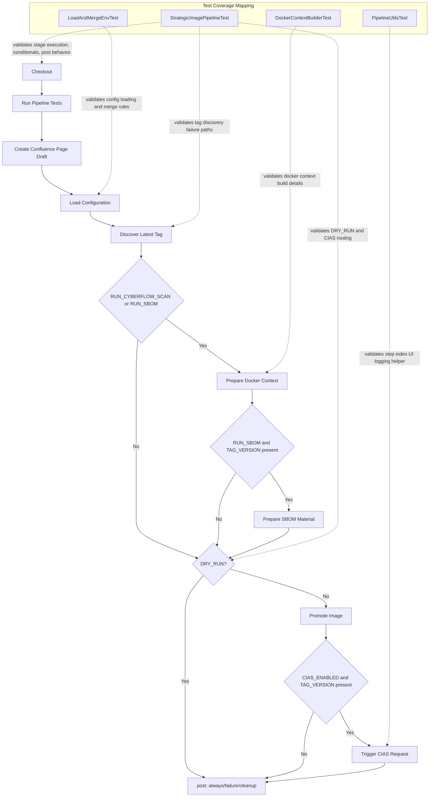

# Jenkins Pipeline Test Casing Guide

## Scope
This document describes the current test casing for the Strategic Image Jenkins pipeline, based on:

- Pipeline definition in `pipelines/strategic_image/Jenkinsfile`
- Pipeline integration-style tests in `pipelines/strategic_image/test/groovy/StrategicImagePipelineTest.groovy`
- Shared pipeline test harness in `pipelines/strategic_image/test/groovy/StrategicImagePipelineTestBase.groovy`
- Supporting unit tests for utility scripts and classes:
  - `pipelines/strategic_image/test/groovy/LoadAndMergeEnvTest.groovy`
  - `pipelines/strategic_image/test/groovy/PipelineUtilsTest.groovy`
  - `pipelines/strategic_image/test/groovy/DockerContextBuilderTest.groovy`

## Test Configuration

### Framework and Runtime
- Build tool: Gradle
- Test framework: JUnit 4
- Pipeline test framework: JenkinsPipelineUnit (`com.lesfurets:jenkins-pipeline-unit:1.9`)
- Groovy version for tests: `2.5.23`

### Active Test Source Set
- Groovy tests: `pipelines/strategic_image/test/groovy`
- Java tests: `pipelines/strategic_image/test/java`

### Test Execution Command
- Local/CI command:

```bash
./gradlew test --rerun-tasks
```

- Jenkins pipeline uses the same command through `TEST_REPORTING_CONFIG.command` in `Run Pipeline Tests` stage.

## Pipeline Flow (Current)

The active stage flow in `Jenkinsfile` is:

1. Checkout
2. Run Pipeline Tests
3. Create Confluence Page Draft
4. Load Configuration
5. Discover Latest Tag
6. Prepare Docker Context (conditional)
7. Prepare SBOM Material (conditional)
8. Promote Image (conditional, skipped for DRY_RUN)
9. Trigger CIAS Request (conditional, skipped for DRY_RUN)
10. post { always, failure, cleanup }

## Pipeline and Test-Casing Diagram



## Test Case Catalog

### A. End-to-End Pipeline Behavior (JenkinsPipelineUnit)
Source: `StrategicImagePipelineTest.groovy`

| Test ID | Test Method | Main Intent | Pipeline Area |
|---|---|---|---|
| TC-01 | `testPipelineFullRunSuccess` | Validates full successful run with major stages | Full stage chain |
| TC-02 | `testCyberflowScanDisabledSkipsStage` | Verifies behavior when Cyberflow scan is disabled | Conditional stage logic |
| TC-03 | `testEmptyTagVersionFailsPipeline` | Fails when no matching tags are available | Discover Latest Tag |
| TC-04 | `testLoadConfigurationUsesIbmDev` | Confirms dev config values are loaded | Load Configuration |
| TC-05 | `testLoadConfigurationUsesIbmProd` | Confirms prod config values are loaded | Load Configuration |
| TC-06 | `testParameterOverridesConfigFileValues` | Confirms params override config values | Load Configuration merge |
| TC-07 | `testDefaultsFallbackForMissingEnvVars` | Verifies fallback defaults for unset env values | Load Configuration fallbacks |
| TC-08 | `testCIASTriggerUsesCurl` | Verifies cURL CIAS trigger branch | Trigger CIAS Request |
| TC-09 | `testCIASTriggerUsesRemoteJob` | Verifies triggerRemoteJob CIAS branch | Trigger CIAS Request |
| TC-10 | `testPostAlwaysArchivesArtifacts` | Verifies artifacts are archived in post-always | post always |
| TC-11 | `testEmptyTagVersionWritesDebugArtifacts` | Verifies debug artifacts on tag failure | Discover Latest Tag |
| TC-12 | `testPostAlwaysUpdatesConfluencePage` | Verifies page create and update flow | Confluence + post always |
| TC-13 | `testPostCleanupRunsCleanWs` | Verifies workspace cleanup in post-cleanup | post cleanup |
| TC-14 | `testDiscoverLatestTagFailsOnNoMatchingTags` | Validates explicit no-match failure | Discover Latest Tag |
| TC-15 | `testConfluenceUpdateFailureDoesNotFailPipeline` | Verifies post-always catches Confluence update errors | post error handling |

Notes:
- Some additional scenarios are present in the test file but commented out (for example DRY_RUN skip case and SBOM-off case).
- Stage name `Cyberflows Scan` is asserted in one happy-path test, while the corresponding stage block in the current Jenkinsfile is commented out.

### B. Helper and Utility Unit Tests

1. `LoadAndMergeEnvTest`
- Validates library resource YAML load and flattening into environment variables.
- Validates non-overwrite behavior when env variables already exist.
- Validates fallback file path behavior.
- Validates error path for missing config.

2. `PipelineUtilsTest`
- Validates `uiStep` default and increment behavior for `STEP_INDEX` based logging.

3. `DockerContextBuilderTest`
- Validates docker pull/save command generation.
- Validates registry credential usage.
- Validates generated summary and JSON context output.

## Coverage Matrix by Pipeline Stage

| Pipeline Stage | Coverage Status | Primary Tests |
|---|---|---|
| Checkout | Covered (included in full run) | `testPipelineFullRunSuccess` |
| Run Pipeline Tests | Covered (included in full run) | `testPipelineFullRunSuccess` |
| Create Confluence Page Draft | Covered | `testPipelineFullRunSuccess`, `testPostAlwaysUpdatesConfluencePage` |
| Load Configuration | Covered | `testLoadConfigurationUsesIbmDev`, `testLoadConfigurationUsesIbmProd`, `testParameterOverridesConfigFileValues`, `testDefaultsFallbackForMissingEnvVars` |
| Discover Latest Tag | Covered | `testEmptyTagVersionFailsPipeline`, `testDiscoverLatestTagFailsOnNoMatchingTags`, `testEmptyTagVersionWritesDebugArtifacts` |
| Prepare Docker Context | Covered | `testPipelineFullRunSuccess`, `testCyberflowScanDisabledSkipsStage`, `DockerContextBuilderTest` |
| Prepare SBOM Material | Covered in full path and condition checks | `testPipelineFullRunSuccess` |
| Promote Image | Covered in full path | `testPipelineFullRunSuccess` |
| Trigger CIAS Request | Covered (both execution paths) | `testCIASTriggerUsesCurl`, `testCIASTriggerUsesRemoteJob` |
| post always | Covered | `testPostAlwaysArchivesArtifacts`, `testPostAlwaysUpdatesConfluencePage`, `testConfluenceUpdateFailureDoesNotFailPipeline` |
| post failure | Partially covered (failure outcomes asserted, not isolated deeply) | Tag failure tests |
| post cleanup | Covered | `testPostCleanupRunsCleanWs` |

## Gaps and Follow-Up Suggestions

1. Uncomment and stabilize currently commented test scenarios in `StrategicImagePipelineTest.groovy`:
   - DRY_RUN skip assertions
   - SBOM disabled flow
   - both scans disabled flow
2. Reconcile `Cyberflows Scan` expectations in tests with the current Jenkinsfile stage status (currently commented out in pipeline).
3. Add explicit test(s) for `post { failure { ... } }` description formatting to improve failure-path confidence.
